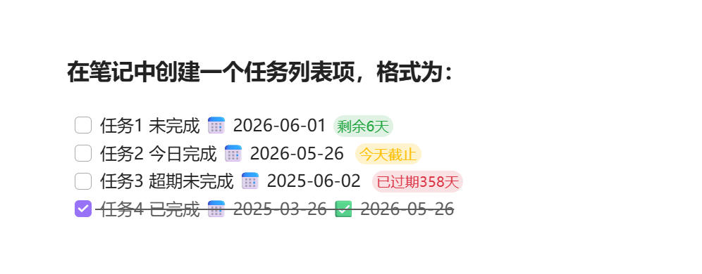

# Task Deadline for Obsidian


A lightweight plugin that adds dynamic countdown days to checklist items based on due dates. Perfect for deadline tracking, project planning, and habit management — all inside your Obsidian vault.



---

## ✨ Features 功能特性

- **自动计算剩余天数**：基于当前系统日期，精确计算未来/过去天数。
- **双模式支持**：
  - **实时预览/阅读模式**：在日期后直接插入剩余天数文本。
  - **源码编辑模式**：通过 CodeMirror 装饰，在不改动原始 Markdown 的前提下，在行尾显示标签。
- **高度可定制**：自定义剩余、过期、今日截止的文本格式。
- **过滤已完成任务**：可选择是否在已勾选的任务上显示剩余天数。
- **主题适配**：自动适应 Obsidian 亮色/暗色主题，且未来（绿）、今天（黄）、过期（红）三色区分。
- **命令与自动刷新**：提供“刷新剩余天数显示”命令；切换文件或修改设置后自动更新。


- **Automatic day calculation** – Computes remaining/elapsed days relative to current system date.
- **Dual‑mode support**  
  - **Live Preview / Reading View** – Inserts countdown text directly after the date.  
  - **Source Mode** – Uses CodeMirror decorations to display a non‑intrusive label at the end of the line, without modifying the original Markdown.
- **Highly customizable** – Define your own text formats for future, overdue, and today’s tasks.
- **Filter completed tasks** – Optionally hide the countdown on checked items.
- **Theme aware** – Automatically adapts to Obsidian light/dark themes with color coding: future (green), today (yellow), overdue (red).
- **Commands & auto refresh** – Manual "Refresh countdown" command, plus automatic updates when switching files or changing settings.

---

## 📦 Installation

### From Obsidian Community Store

1. Open **Settings → Community Plugins** and turn off **Restricted mode** if needed.
2. Click **Browse** and search for **Task Deadline**.
3. Install the plugin and enable it.

### Manual Installation

1. Go to your vault’s plugin folder:  
   `<vault-root>/.obsidian/plugins/`
2. Create a new folder named `task-deadline`.
3. Place the following files inside it:  
   - `main.js`  
   - `manifest.json`  
   - `styles.css`  
   - `README.md` (optional)
4. Restart Obsidian or click the **Refresh** button in **Settings → Community Plugins**.
5. Find **Task Deadline** in the installed plugins list and enable it.

---

## 🚀 Usage

1. Create a task list item using the following format:  
   `- [ ] Task description 📅 YYYY-MM-DD`  
   Example: `- [ ] Submit report 📅 2026-06-01`
2. The plugin will automatically append the countdown after the date:  
   `- [ ] Submit report 📅 2026-06-01 (6 days left)`
3. In **Source mode**, the countdown is displayed as a light label at the end of the line and **never written to the original file**.
4. Adjust display texts, colors, and show/hide completed tasks in the plugin settings.

---

## ⚙️ Configuration

Open **Settings → Community Plugins → Task Deadline → Gear icon** to customize:

| Option | Description | Default |
|--------|-------------|---------|
| Show for completed tasks | When disabled, checked tasks will not show the countdown | `Enabled` |
| Future days text | Format for future dates. `{days}` is replaced by the actual number | `{days} days left` |
| Overdue days text | Format for past dates | `{days} days overdue` |
| Today’s deadline text | Text shown when the due date is today | `Today` |
| Show decoration in source mode | Display the countdown label in Source Mode (CodeMirror decoration) | `Enabled` |

> **Note:** After changing any text option, all open notes will refresh automatically.

---

## 🖥️ Compatibility & Limitations

- **Minimum Obsidian version**: `0.15.0` (requires CodeMirror 6 support)
- **Supported views**:
  - ✅ Live Preview mode
  - ✅ Reading View
  - ✅ Source Mode (with decorations)
  - ❌ Export to PDF/HTML – dynamic labels are **not** included (decorations are not written to the source file)

---

## 🛠️ Development & Contributions

Issues and pull requests are welcome! To build the plugin locally:

```bash
git clone <repo-url>
cd task-deadline
npm install
npm run build

---
